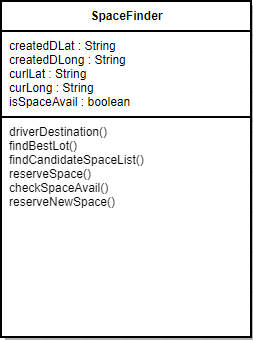
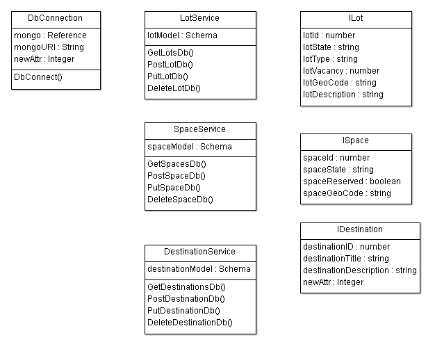

# ParkMe Final Report
#

## Table of Contents ##

**[Table of Contents](#Table_of_Contents)**

**[Summary of Changes](#Summary_of_Changes)**

**[Customer Statement of Requirements](#Customer_Statements)**

**[Glossary](#Glossary)**

- *[Technical Terms](#technical)*
- *[Non-Technical Terms](#nontechnical)*

**[Functional Requirement Specifications](#Functional_Requirement)**

- *[Stake Holders](#stake_holders)*

- *[Actors and Goals](#actors_goals)*

- *[Use Cases](#use_cases)*

- *[Full Case Descriptions](#full_desc)*

- *[System Sequence Diagrams](#seq_diagram)*

- *[Traceability Table](#trace_table)*

**[Nonfunctional Requirements](#Nonfunction_Reqs)**

**[Effort Estimation using Use Case Points](#Effort_Estimation)**

**[Domain Analysis](#Domain_Analy)**

- *[Domain Model](#domain_model)*

- *[System Operation Contacts](#op_contacts)*

- *[Mathematical Model](#math_model)*

**[Interaction Diagrams](#Interaction_Diagrams)**

**[Class Diagram and Interface Specification ](#Class_Diagram)**

- *[Class Diagram](#class_diagram)*

- *[Data Types and Operation Signatures](#data_types)*

**[System Architecture and System Design](#System_Architecture)**

- *[Architectural Styles](#Architectural_Styles)*

- *[Identifying Subsystems](#Identifying_Subsystems)*

- *[Mapping Subsystems to Hardware](#Mapping_Subsystems)*

- *[Persistent Data Storage](#Persistent_Data_Storage)*

- *[Network Protocol](#Network_Protocol)*

- *[Global Control Flow ](#Global_Control_Flow)*
	
**[Algorithms and Data Structures](#Algorithms_and_Data_Structures)**

- *[Algorithms](#Algorithms)*

- *[Data Structures](#Data_Structures)*

**[User Interface Design and Implementation](#User_Interface_Design)**

**[History of Work & Current Status of Implemenation ](#History_of_Work)**

**[Conclusions and Future Work ](#Conclusion)**

**[References](#References)**

## Summary of Changes ##

## Customer Statement of Requirements ##

Parking at Sacramento State is a hassle. After arriving at the school, one can expect spending 5-15 minutes locating a vacant spot to park. At peak times, this time can become even greater. And at the beginning of the semester when people are trying to add classes, the parking situation can get so bad that students get so frustrated that they turn around and go home because they can’t find a vacant spot. According to source, students that don’t make it to class on time on average have GPA’s that are # points lower than their punctual counterparts and students that don’t make it to class have GPA’s that are # lower. This is a huge problem and needs to be resolved.

Currently, in an effort to ease the strain on the current parking lot system at Sac State, they have decided to build an entirely new 5 story parking structure that will cost around $25 million to complete. There is also an app on the Sac State App that provides “real time” parking availability that has proven to be completely worthless and does not provide good enough information to be useful. And finally, there is temporary road work sign that is used at the North entrance of the school to display which lots are full and recently they’ve actually removed the sign. Clearly this situation is a mess. The system is disorganized and instead of spending $25 million to build new structures, we believe that more connected and responsive parking lots will be able to help parking enforcement and students come to a more logistic friendly resolution when it comes to parking.

The current system uses manually inputted data entered by parking enforcement to display a percentage of how full each lot is. This leaves a lot of room for human error and laziness as lot info has been shown on the Sac State App to go unedited for hours. What we are proposing is coming up with a real-time system to not just monitor the percentage of how full each lot is, but with a preciseness of exactly which spots are still vacant. This information can then be passed on to parking enforcement and students alike to guide students to vacant spots.

Each parking spot will be equipped with a module that can be used to detect whether or not a vehicle is present at the spot with 99.99% percent accuracy. The module will use a HC-SR04 Ultrasonic sensor and will connect to a microcontroller. The microcontroller will be able to analyze the data coming into the sensor and be able to determine if a car is present or not. The microcontroller will then send information to a remote web server where the data will be stored. This data can then be used by parking enforcement and students/faculty alike to tell where parking is available.

The average student/faculty user will be able to use the app on their own to find a spot. The home screen of the app will display a heat map of Sacramento State and all the parking lots/structured on campus. From there a user can do a sort, for example a faculty member can limit their query to faculty only lots. Or if they'd like they can click on a parking lot/structure to get a view in real time of where parking spots are available within that parking lot/structure. Once they have a map of what spots are open, all that's left is to drive to that spot and park there. Once they park in a vacant spot, the sensor gets triggered at that spot and the app updates, making the spot appear as "not vacant" on app.

Another scenario is student/faculty may want to park in closest proximity possible to a desired building. Actual commute time on foot is another major consideration that needs to be addressed when designing a system used to optimize logistics. There might be a sizable amount of parking available at lot 7 but let’s say the user's first class is at 9am at the opposite end of campus in Solano Hall. A better place to park would be Lot 1. There's a 0.5 mile difference and a 8 minute difference in walking time from lot to classroom! What a user would be able to do is pick what classroom they want to be closest to. The app will then return a list of spots it recommends parking at based on availability and odds that a parking spot will still be available by the time the user gets the parking lot/structure.

Sometimes the app itself can be very difficult to navigate through. The user opens the app, finds it confusing, and out of frustration may decide not to use it ever again. That’s why our app will be very user friendly. It will mainly focus on finding a vacant parking spot with a few other options that the user may wish to use, such as the sorting feature mentioned earlier. The user can easily choose whether to toggle these other options on or off. The app will be able to find a parking spot with just a few taps after first being set up. Say the user is in a hurry; the user will be able to open the app and within # taps, the app has already found a vacant parking spot for the user.

The database will have outbound communication with the cell phone app along with a possible desktop application. Using a homegrown proprietary REST API in conjunction with the SQL database, the app and web interface alike will have the capability of data extraction through JSON. An example implementation of the getLot method on the REST API would be to display the lot info through JSON. From there, the app and web interface alike can parse the data and generate kml overlays to be used on the google maps map. Possible additional implementation would be to have the web server generate these kml files but the speed practicality of this method is yet to be determined.

The system as a whole will largely be event based. The database becomes updated once it receives stimulus of a change in state from the sensors via the internet. From there, signs and displays will be updated based on the new overall state of the database. The web interface and mobile phone app will also be updated based on these events but may be updated incrementally to save bandwidth. The mobile app and interface are also event based systems in their own respect. A click to see the detailed state of a lot is an event trigger by the user. A request to receive directions to a certain spot is also an event created by the user. 

## Glossary ##
### Technical Terms ###

1. Database - collection of data that hold the parking lots, parking space and availability 
2. Sensor - a device that detects whether a parking space is occupied 
3. Rest API - web services are a way of providing interoperability between computer systems on the Internet
4. Google Maps - Google Maps is a web mapping service developed by Google integrated to find the current location of the user
5. Geo-coordinates - number based coordinate system used in geography that enables every location on Earth
6. Raspberry PI - microcomputer used to communicate the sensor information with the database

### Non-Technical Terms ###

1. Vacant - refers to parking spaces available for use
2. Driver - refers to the user of the application searching for a parking space
3. Hands Free - navigation directions are provided through the application

## Functional Requirement Specifications ##

### Priority Description of Requirements ###

**REQ-1: 3** System locates user's current location to optimize search.

**REQ-2: 2** System provides user with real time data showing what parking lots are the fullest.

**REQ-3: 5** System shall provide user with lot options to choose from.

**REQ-4: 5** System accesses the database to locate vacant parking spaces.

**REQ-5: 4** System is able to reroute the user to a different location if the spot is taken by someone else.

**REQ-6: 3** System provides user option to navigate to the parking space.

**REQ-7: 1** System can provide user with data demonstrating expected flow derived from date, time, and lot.

**REQ-8: 5** System shall record all occupied and vacant spots to the database on real time. 

### Stakeholders ###

The following people are the one's who might benefit and get involved with the app:

-Students

-Faculty staff/members

-Parking enforcers

-Database manager

### Actors and goals ###

**Driver** (Initiating Actor)

* A Driver can be a university student, faculty member, or campus staff. Drivers are the primary consumers of the system. A Driver's goal is to find the nearest available parking space based on their approach to campus or destination on campus.

**Parking enforcer** (Initiating Actor) 

* An enforcer can be a parking enforcement employee or an admin. They maintain and scout the garage for safety and checks the validity of the permit in every vehicle. They can also manually override a certain spot/s if they need to close it for maintenance or reservations.

**Sensor** (Participating Actor)

* A Sensor provides the self-report technology the system relies on to determine the occupancy status of an individual space in a parking lot. The Sensor provides real-time status updates of either occupied or vacant.

**Navigator** (Participating Actor)

* The Navigator guides a driver to a vacant parking spot. The Navigator provides several important services: first, it tracks the current location of a driver; second, it provides a route to a parking lot; third, it provide audio directions to the driver. 

**SpaceFinder** (Participating Actor)

* The SpaceFinder provides the system with real-time tabulation of the total number of vacant spaces in each parking lot on campus, and locates the best parking lot and available space.

## Use Cases ##

** Use Case 1 - ParkMe Valet: ** Automates trip from start to finish.

** Use Case 2 - ParkMe Near: ** Lets the user park nearby a specific destination.

** Use Case 3 - Manual Override: ** Allows a parking enforcer to change the status of a parking spot by manually closing and opening it through the system.

## Fully Dressed Use Case Descriptions ##

### Use Case 1 - ParkMe Valet ###
**Related Requirements:** REQ 1,2,4,5,6,8

**Initiating Actor:** Driver

**Goal:** User wants to find closest possible parking spot from their current location

**Participating Actors:** Sensor, SpaceFinder, Navigator

**Preconditions:** A parking spot must be available, all services must be up and running

**PostConditions:** User is given directions on how to get to the closest and optimal parking spot

**Main Success Scenario:**

1) User opens up app with location permissions enabled

2) Google Maps is able to locate phone

3) User must select ParkMe Valet option

4) Database returns all possible parking places

5) Google Maps chooses closest and optimal spot

6) Google Maps uses navigation to direct user to parking place

**Extensions:** Spot gets taken by another vehicle before user has arrived at desired parking spot.

### Use Case 2 - ParkMe Near ###
**Related Requirements:** REQ 1,2,3,4,5,6,7,8

**Initiating Actor:** Driver

**Goal:** Lets the user select a certain lot and park nearby a specific destination.

**Participating Actors:** Sensor, SpaceFinder, Navigator

**Preconditions:** A parking spot must be available, a certain spot must be selected.

**PostConditions:** User is given directions to their selected lot and search for the closest and optimal parking spot

**Main Success Scenario:**

1) User opens up app with location permissions enabled

2) Google Maps is able to locate phone

3) User must select ParkMe Near option and select a lot

4) Database returns all possible parking places

5) Google Maps chooses closest and optimal spot

6) Google Maps uses navigation to direct user to parking lot and the spot afterwards

**Extensions:** Spot gets taken by another vehicle before user has arrived at desired parking spot.

### Use Case 3 - ManualOverride ###

**Related Requirements:** REQ 2,3,4,7,8

**Initiating Actor:** Parking enforcer

**Goal:** User has the access to manually change the status of a certain spot.

**Participating Actors:** Sensor

**Preconditions:** Parking lot must be vacant.

**PostConditions:** A parking lot will be closed/open.

**Main Success Scenario:**

1) Parking Enforcer will choose a certain spot or spots.

2) Parking Enforcer can manually change the status of a spot if it needs to be down for maintenance or reservation.

3) The Sensor will display green if it's open, and red if it's closed.

###  System Sequence Diagram ###

** Use Case 1 - ParkMe Valet: **

Utilizing the location service provided by a mobile device, ParkMe tracks the driver's progress toward campus, and when s/he is close to campus ParkMe checks with the SpaceFinder to find the closest parking lot with the highest availability. Once the driver enters the parking lot the Navigator requests the geo coordinates for and available space and automatically routes them to spot. 

** Use Case 2 - ParkMe Near: **

The key difference between ParkMe Near and ParkMe Valet is that the driver can have the system prioritize parking lots close to his/her destination.

** Use Case 3 - Manual Override: ** 

In the works..

## Traceability Table ##

		UC1	UC2	UC3
	----------------------------------------------------------------------------------------------------------
	REQ1	 X	 X 
	----------------------------------------------------------------------------------------------------------
	REQ2	 X	 X	 X	 	
	----------------------------------------------------------------------------------------------------------
	REQ3		 X	 X 	
	----------------------------------------------------------------------------------------------------------
	REQ4	 X 	 X	 X		
	----------------------------------------------------------------------------------------------------------
	REQ5	 X	 X						
	----------------------------------------------------------------------------------------------------------
	REQ6	 X	 X	 			
	----------------------------------------------------------------------------------------------------------
	REQ7	 	 X	 X				
	----------------------------------------------------------------------------------------------------------
	REQ8	 X	 X	 X
	----------------------------------------------------------------------------------------------------------		

## Nonfunctional Requirements ##

In the works..

## Effort Estimation using Use Case Points ##

##  Domain Analysis ##

###  Domain Model ###

###  System Operation Contacts ###

-report 1

##  Interaction Diagrams ##

In the works..

##  Class Diagram and Interface Specification ##

The diagrams below provide an overview of the key classes used in our system.

**Sensor Class Diagrams**

The sensor class utilizes a Raspberry Pi microcomputer in conjunction with a supersonic sensor which is used to detect the physical presence of a vehicle in a parking spot. When the supersonic sensor detects a vehicle, it sends a signal to the raspberry pi. From there, the pi is able to send information to the server on the status of the parking spot.

**Navigator Class Diagrams**

The Navigator class uses the users current Geo-location coordinates and the destination coordinates to setup a route. The destination Geo coordinates are set to the campus if the user is more than a mile away. Once entering a parking lot the polling function will invoke the SpaceFinder class to find new Geo coordinates and set up a route. The route is determined by the latitude and longitude values received back from SpaceFinder. Polling will continue to take place every 10 seconds and update routes. Once a route has been found the Google Maps Directions API will take over. Proceeding updates will be managed by the Google Maps Direction API. 

**SpaceFinder Class Diagrams**

ParkMe Valet mode: The SpaceFinder class tries to find the best and closest parking spot from the current location of the user.

ParkMe Near mode: The SpaceFinder class let's the user choose where they want to park from a list of locations.

The SpaceFinder class uses the database to determine whether the parking space is vacant. If the parking space chosen by the SpaceFinder class is vacant, it will create a set of Geo location coordinates, using Google Maps API, of that parking space and hand them to the Navigator class. While the driver is on route, the SpaceFinder class will keep checking as to whether the parking spot is still vacant. If the parking space happens to fill up, the SpaceFinder class will find the closest parking space from the previous parking spot, create another set of Geo-location coordinates, and give them to the Navigator Class again.

- driverDestination // Used in the ParkMe Near use case

Methods

- FindBestLot( pDriverDestination : destinationId = NULL )
- FindCandidateSpaceList( pLot : lotId )
- ReserveSpace( pSpace : spaceId ) --->

**REST API Class Diagrams**

The REST API relies on deep linking to build the necessary routes. The RouterAPI class dynamically builds new routes based on the current folder structure to simplify future expansion.

**Db Access Class Diagrams**

The DbAccess classes support basic CRUD operations for the parkdbcsus Cosmos DB database. In addition, some helper methods have been defined for key operations, such 

The Web and Android apps will be accessing the REST API through HTTP protocols since the database is hosted on the Azure Cloud.

**Web Admin Class Diagrams**

The WebAdmin classes are used by the system administrator to manage the parking lots with related parking spaces as well as the on campus destinations a driver can choose from in the ParkMe Near mode.

**Web DriverPark Class Diagrams**
The Web DriverPark classes are used by a driver to accomplish the following tasks: select the ParkMe mode (i.e., ParkMe Valet or ParkMe Near); optionally select a destination when the ParkMe Near mode is chosen; provide a visual map of the route.

### Data Types and Operation Signatures ###

####Navigator:####

***Attributes:***

			curLat: String			
						Corresponds to the users current latitude coordinate.
			curLong: String			
						Corresponds to the users current longitude coordinate.
			dLat: String			
						Corresponds to the users destination latitude 
						coordinates. This value will be derived or set to 
						relevant campus coordinate as default.
			dLong: String			
						Corresponds to the users destination longitude 
						coordinates. This values will be derived or set to 
						relevant campus coordinate as default.

***Operations:***

		
			Navigator(String lat, String long)
						Constructor method takes in the current Geo coordincates
						and stores the values.
			getDLat()			
						Method retrieves the users expected destination latitude 
						coordinates.
			getDLong()			
						Method retrieves the users expected destination longitude coordinates.
			getDestination(SpaceFinder dCoordinate)		
						Method will use the information received from spaceFinder 
						to set up destination coordinates (vacant space or campus) 
						depending on the users current location
			travelMode()		
						Sets up the travel mode to vehicle to be used by the 
						Google Maps Directions API when handed- off.
			pollingLocation()	
						Method will continuously poll the SpaceFinder to update 
						the routes to get to the vacant space.
			setCurLocation()	
						Method sets up the Google Maps Directions API with current 
						location.
			setDestination()	
						Method sets up the Google Maps Directions API with desired 
						destination Geo coordinates.
			checkIntent()		
						Method will check to see if there is a valid intent can 
						startActivity with an activity ready to receive the 
						intent.
			navigateIntent()	
						Calls Google Maps Directions API with valid new Intent and 
						context.

####SpaceFinder####

***Attributes:***

        createdDLat: String            
                    Corresponds to the users destination latitude coordinates. 

        createdDLong: String           
                    Corresponds to the users destination longitude coordinates.

        curLat: String          
                    Corresponds to the users current latitude coordinate.

        curLong: String         
                    Corresponds to the users current longitude coordinate.

		isSpaceAvail : boolean
					True if space is vacant false if not.
					

***Operations:***

        driverDestination()
					Used in ParkMe near, lets user choose from a list of buildings.

        findBestLot()
        			Automatically finds best lot from the user’s current location or from driver destination.

        findCandidateSpaceList()
					Automatically finds best space.

        reserveSpace() 
		 			Reserves space for user and creates a set of Geo-coordinates, but does not guarantee space will not fill up.

        checkSpaceAvail()     
                    Continually checks with sensor if the Space is vacant or not.

		reserveNewSpace()	
					If space is taken, will find a new Space and creates a new set of Geo-coordinates.	 
	

## System Architecture and System Design ##

### Architectural Styles  ###

The ParkMe solution is built upon a client/server architecture and consists of three-tiers. Clients include the following: Web-based Administration and Driver sites; Android mobile app; Sensor Controllers.

**Client/Server**

1. Cloud database
2. Web Server: URL based REST API
3. Web-based Administration and Driver sites; Android-based mobile Driver app

The image below provides a high level overview of the system architecture:

### Identifying Subsystems ###

Everything will start on the sensor checking if a spot is available, then it will send the information to the database. The database comprises a subsystem that includes the components of parkings lots, spaces, and destination. The server then will communicate through the mobile app, which includes it's subsystem on services such as get lots, spaces, and destination.

The image below identifies the subsystems:

### Mapping Subsystems to Hardware ###

Outline of subsystems to hardware:

- Space Sensor: Ultrasonic Sensor HC-SR04
- Space Report: Raspberry Pi
- ParkMe Database: Azure Cosmos DB "dbName=parkdbcsus"
- REST API: Azure virtual machine
- Web Admin Site: Azure virtual machine
- Web Driver Site: Azure virtual machine
- Mobile Driver App: Android mobile device

### Persistent Data Storage ###

A repository of the parking lots will be managed in an Azure Cosmos DB. The following data schema will be used to store JSON objects.

**Parking Lot Schema**

{
"lotId" : "number",
"lotState" : "string",
"lotType" : "string",
"lotVacancy" : "number",
"lotGeoCode" : "string",
"lotDescription" : "string"
}

**Parking Space Schema**

{
"spaceId" : "number",
"spaceState" : "string",
"spaceReserved" : "boolean",
"spaceGeoCode" : "string"
}

**Destination Schema**

{
"destinationId" : "number",
"destinationTitle" : "string",
"destinationDescription" : "string"
}
### Network Protocol ###

The following network protocols are used:

- ParkMe Database REST API: HTTP 
- ParkMe Web App: HTTP
- Space Report: IoT

### Global Control Flow  ###

Our system will be based on Time-Dependency, the sensors will check the parking spot status on real-time and it will update the database every few seconds, and the results will be sent to the mobile app if it's ready to be routed.

## Algorithms and Data Structures ##

### Algorithms ###

**Design Patterns**

Observable

- Database calls via HTTP
- CandidateSpaceList collection to be notified when space availability changes

### Data Structures ###

**Lists**

Lists will be the main data structure used to store information such as vacant spaces, each driver's set of space options, etc. The Web Admin classes will be the ones that predominantly use this data structure to store the information.

## User Interface Design and Implementation ##

Simplicity is what distinguishes the ParkMe app for other solutions. Thus, the user interface is minimal since our objective is a hands-free experience for the driver once they are enroute and unless the administrator needs to upload a new park definition or suspend access to a parking space the Sensor is self-reporting so maintenance is minimal. However, we do have some simple user interfaces that can be accessed as shown below:

## History of Work & Current Status of Implemenation  ##

## Conclusions and Future Work ##

## References ##

