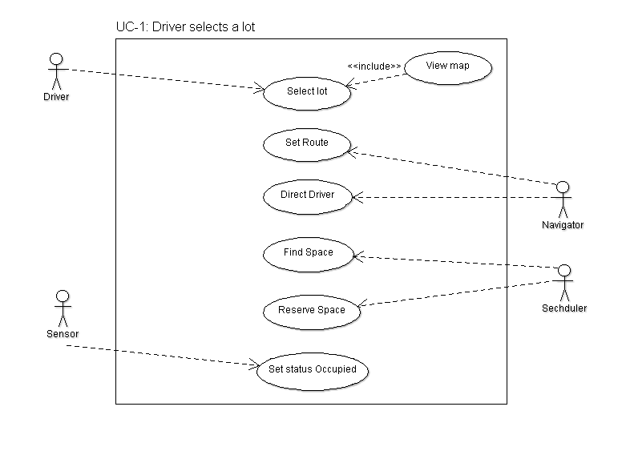
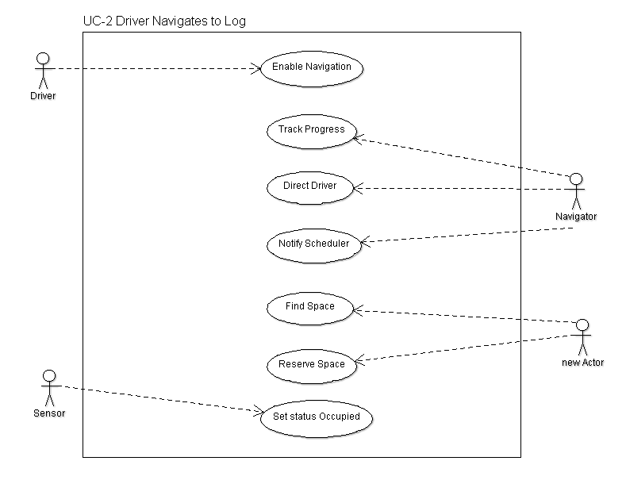
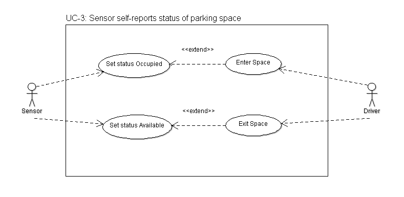

# Parking Finder Report
#

## Introduction ##

**Goal**

Our goal is to help a university driver quickly and easily locate an available space in an university campus parking lot. Our solution will help the driver easily determine which parking lot provides the highest availability of vacant spaces, based on either their approach or destination. 

**Problem Statement**

Currently, when a driver goes to a university campus s/he is unable to determine which parking lot might have spaces available, and must first guess which parking lot to enter and then drive lane by lane through the lot hoping to find a vacant spot. If s/he is unable to find a vacant spot in the current parking lot, then s/he must guess which lot to try next and repeat the painful process of traversing lane by lane to try and find a spot. 

**Proposed Solution**

Our application will help a user quickly and easily find an available space in a campus parking lot in the following ways:

* Our solution will route a user to the parking lot with the most available spaces based on either their approach to the campus or final destination on campus. 
* Our solution will automatically reserve a candidate space for a user and route them to the location. 
* Since a reserved spot might become occupied by another driver before our user arrives at the location, our solution will be able to quickly reroute the user to nearest available vacancy.
* Significantly, our solution will provide our user with audio directions since s/he will be driving while looking for an available parking space.

For additional details about our solution, refer to 
***Customer Statement of Requirements.docx***.

## Glossary ##

In the works...

## System Requirements ##

### Functional Requirements ###

**REQ-1: 1** System shall store data for all campus parking lots. The definition for each parking lot will include the location of each space.

**REQ-2: 1** System shall be able to determine real-time the availability of a parking space.

**REQ-3: 2** System shall be able to identify which parking lots have vacant parking spaces and rank the lots by available spaces based on the approach or destination of a user.

**REQ-4: 2** System shall be able to route a driver to a parking lot with available spaces.

**REQ-5: 2** System shall be able to route a driver to a packing space with a lot.

**REQ-6: 3** System shall be able to reserve a vacant space for a user and provide routing to that location.

**REQ-7: 4** System shall be able to reroute a user to the next closest available parking space if the reserved spot is occupied by another driver before s/he arrives at the location.

**REQ-8: 5** System shall be able to display a map of the campus with visual indications for available parking spaces. 

**REQ-9: 5** System shall allow an administrator to input parking lot information and manually maintain availability of each space.

### Non-functional Requirements ###
**REQ-10** System shall be able to scale.

## Functional Requirement Specifications ##

### Stakeholders ###
	
The following people will benefit from our solution:

* Drivers, which might include university students, staff members, and faculty members, who need to be able to park on campus and walk to their destination typically in time to arrive at a scheduled appointment or class

* Campus Parking Enforcement, who want to direct drivers to the optimal locations for available parking spaces and also need to minimize traffic congestion during peak academic hours.

### System Components ###
**Database**

Relation database that stores information about parking lot structure as well as location and status of parking spaces for system.

**Sensor with Raspberry PI**

Provides system with real-time status of parking space occupancy

**Navigator**

Provides system with Driver location. Enables system to provide Driver with audio directions. Currently evaluating Google Location API.

**Scheduler**

Allows system to identify available parking space based on Driver location and database information.

**Mobile App**

Provides system interface for user to select a lot or enable auto navigation. Also provides system with real-time access to Driver location.

**Web Site**

Provides system interface for administrator to maintain parking lot information and manually override parking space status.

### Use Cases ###

#### Actors and goals ####

**Driver** (Initiating Actor) - A Driver is a university student, staff member, or faculty member who needs to park a vehicle on a campus parking lot.

**Sensor** (Initiating Actor) - A Sensor determines the availability of a space in a parking lot.

**Navigator** (Participating Actor) - The Navigator determines the current location of a driver and provides a route to an available space within a parking lot.

**Scheduler** (Participating Actor) - The scheduler can reserve an available spot for a driver and also provide a list of alternative options.

**Enforcer** (Initiating Actor) - An Enforcer is a member of the parking campus staff who assists drivers in locating available parking spaces and manages traffic flow on campus.

**Administrator** (Initiating Actor) - An Administrator is responsible for maintaining the database of campus parking lots and may also use the information in the repository to interface with other media used to broadcast parking availability.

#### Use Cases: Descriptions ####

**UC-1: Driver selects a lot** 
Driver manually selects a specific lot and system provides routing and scheduling services. This use case will allow the user to select a preferred parking lot or a lot closest to their destination

**UC-2: Driver navigates to a lot**
Driver enables navigation to reach a parking space. In this scenario the system will select the optimal parking lot based on the user's location and number of lot vacancies. This use case will allow the user to rely the system to provide the most up-to-date information as s/he approaches the campus.

**UC-3: Sensor self-reports status of parking space**
Sensor will be able to self-report any change the parking lot that it monitors. This use case will allow the system to know if an individual space is available or occupied.

**UC-4: Enforcer manually updates status of parking space**
Driver will be able to manually change the status of a parking space. This use case will allow parking enforcement to override self-report feature for one or more spaces, which might be used in scenarios of rezoning, construction, etc.

### Use Case Scenarios ###

#### UC-1: Driver selects a lot ####
**Goal** 

Driver wants to select a preferred parking lot.

**Preconditions**

Mobile app running with location permissions enabled

**Main Scenario**

1. Driver sees a campus map
2. Driver selects a preferred parking lot based on approach or destination preferences
3. Navigator sets route for preferred lot
4. Navigator gives directions for preferred lot
5. Navigator tracks user progress and notifies Scheduler when Driver arrives at lot
6. Scheduler finds an available space
7. Scheduler reserves an available space
8. Navigator guides Driver to available space
9. Driver arrives and parks in space
10. Sensor self-reports space is occupied

**Exceptions**

* 9.1 Driver loses reserved space to another Driver
* 9.2 Scheduler reserves the next available space closest to current location of Driver
* 9.3 Navigator sets route for next available space
* 9.4 Driver arrives and parks in next available space

#### UC-2: Driver navigates to a lot ####
**Goal**

Driver relies on the system to guide them to the parking with highest availability and direct them to an available parking space.

**Preconditions**

Mobile app running with location permissions enabled

**Main Scenario**

1. Drivers enables automatic navigation
2. Navigator tracks Driver progress toward campus
3. Navigator notifies Scheduler when Driver is N miles from campus
4. Scheduler finds nearest parking lot with highest number of available spaces
5. Navigator sets route for selected lot
6. Navigator notifies Scheduler when Driver arrives at parking lot
7. Scheduler finds nearest available space
8. Scheduler reserves available space
9. Navigator guides Driver to available space
10. Driver arrives and parks in space
11. Sensor self-reports space is occupied

**Exceptions**

* 10.1 Driver loses reserved space to another Driver
* 10.2 Scheduler reserves the next available space closest to current location of Driver
* 10.3 Navigator sets route for next available space
* 10.4 Driver arrives and parks in next available space

#### UC-3: Sensor self-reports status of parking space ####
**Goal**

Sensor provides real-time status of parking space status.

**Preconditions**

Parking space is available

**Alternative Scenario 1**

1. Driver parks in available parking space
2. Sensor notifies system that parking space is unavailable

**Preconditions**

Parking space is occupied

**Alternative Scenario 2**

1. Driver exists occupied parking space
2. Sensor notifies system that parking space is available

