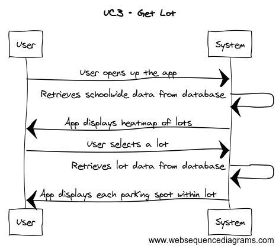

# Parking Finder Report
#

## Contents ##

**[Project Proposal](https://github.com/CSUS-CSC-131-Fall2017/park/blob/master/Pink%20Unicorns%20-%20Proposal.md)**

**[Introduction](#Introduction)**

**[Glossary](#Glossary)**

**[Functional Requirement Specifications](#Functional_Requirement)**

- *[Stake Holders](#stake_holders)*

- *[Customer Requirements](#cust_reqs)*

- *[Actors and Goals](#actors_goals)*

- *[Use Cases](#use_cases)*

	- *[Descriptions](#case_descriptions)*

	- *[Full Case Descriptions](#full_desc)*
	
	- *[Use Case Diagram](#use_diagram)*
 
	- *[Traceability Table](#trace_table)*

	- *[System Sequence Diagrams](#seq_diagram)*

**[Nonfunctional Requirements](#Nonfunction_Reqs)**
	
**[Domain Analysis](#Domain_Analy)**

- *[Domain Model](#domain_model)*

- *[System Operation Contacts](#op_contacts)*

- *[Mathematical Model](#math_model)*

## Introduction ##

**Goal**

Our goal is to help a university driver quickly and easily locate an available space in an university campus parking lot. Our solution will help the driver easily determine which parking lot provides the highest availability of vacant spaces, based on either their approach or destination. 

**Problem Statement**

Currently, when a driver goes to a university campus s/he is unable to determine which parking lot might have spaces available, and must first guess which parking lot to enter and then drive lane by lane through the lot hoping to find a vacant spot. If s/he is unable to find a vacant spot in the current parking lot, then s/he must guess which lot to try next and repeat the painful process of traversing lane by lane to try and find a spot. 

**Proposed Solution**

Our application will help a user quickly and easily find an available space in a campus parking lot in the following ways:

* Our solution will route a user to the parking lot with the most available spaces based on either their approach to the campus or final destination on campus. 
* Our solution will automatically reserve a candidate space for a user and route them to the location. 
* Since a reserved spot might become occupied by another driver before our user arrives at the location, our solution will be able to quickly reroute the user to nearest available vacancy.
* Significantly, our solution will provide our user with audio directions since s/he will be driving while looking for an available parking space.

For additional details about our solution, refer to <a ref="Customer Statement of Requirements.docx">***Customer Statement of Requirements.docx***</a>.

## Glossary ##

In the works...

## System Requirements ##

In the works...

## Functional Requirement Specifications ##

### Stakeholders ###
	
The following people are the one's who might benefit and get involved with the app:

-Students

-Faculty staff/members

-Parking enforcers

-Database manager	

### Actors and goals ###

**Hardwired sensors** Participating Actor (**GetSpots** UC-4)

-> Detects if a vehicle in a certain spot is present, "Green" light means vacant, "Red" means occupied.

**Digital Displays** Participating Actor (**GetCurrentData** UC-2,UC-4)

-> Goal is to display how many spots are remaining in a given lot.

**Mobile App** Participating Actor (UC-2, **ReserveSpot** UC-5)

-> This is where consumers check for open spots, and reserve for parking spots if the feature is available.

**Database** Participating Actor (UC-2, **GetPastData** UC-7)

-> Stores all the data, status and information in all parking spaces/garages.

**Google Maps API** Participating Actor (**NavigateToLot** UC-1, UC-6)

-> Guides user to their parking spot.

**Parking enforcers/employees** Initiating Actor 

-> They maintain and scout the garage for safety and checks the validity of the permit in every vehicle.

**Student/Faculty member** Initiating Actor (UC-2, UC-7)

-> The primary consumers in the system. User has the ability to access the mobile app to view current and historical parking space vacancy

### Priority Description of Requirements ###

**REQ-1: 3** System locates user's current location to optimize search.

**REQ-2: 2** System provides user with real time data showing what parking lots are the fullest.

**REQ-3: 5** System shall provide user with lot options to choose from.

**REQ-4: 5** System accesses the database to locate vacant parking spaces.

**REQ-5: 4** User is able to reserve the parking space for brief time, while they drive to the location.

**REQ-6: 3** System provides user option to navigate to the parking space.

**REQ-7: 1** System can provide user with data demonstrating expected flow derived from date, time, and lot.

**REQ-8:**  System can lookup user schedule and suggest parking lots that are available and prioritize based on destination.

**REQ-9: 5** System shall record all occupied and vacant spots to the database on real time. 

### Use Cases: Descriptions ###

**UC-1: FindLot** User uses their current location to find a parking lot.

**UC-2: GetCurrentData** User access real time data on a parking lot's vacancy.

**UC-3: GetLot** User chooses a parking lot.

**UC-4: GetSpots** User searches for available parking spaces.

**UC-5: ReserveSpot** User reserves a parking space for a brief time.

**UC-6: NavigateToLot** User chooses to use navigation to reach the parking space.

**UC-7: GetPastData** User access data information showing expected trends of occupancy per parking lot.

**UC-8: Enter Scheduer** User can create a schedule of destinations based on weekly calendar so that the system can suggest parking lots.

**UC-9: SuggestLots** System suggests parking lots by available number of spots and users scheduled destination.

**UC-10: TicketViolations** Allows a parking enforcer to ticket a driver if they violate the parking rules.

**UC-11: ManualOverride** Allows a parking enforcer to change the status of a parking spot by manually closing and opening it through the system.

## Traceability Table ##

		UC1	UC2	UC3	UC4	UC5	UC6	UC7	UC8	UC9	UC10	UC11
	--------------------------------------------------------------------------------------------------------------
	REQ1	 X
	--------------------------------------------------------------------------------------------------------------
	REQ2		 X	 X	 X		 		 	 X	 X	 X
	--------------------------------------------------------------------------------------------------------------
	REQ3	 X	 X	 X 	 X		 	 X	 X	 X
	--------------------------------------------------------------------------------------------------------------
	REQ4		 X		 X	 X	 X		 X	 X	 X	 X
	--------------------------------------------------------------------------------------------------------------
	REQ5					 X				
	--------------------------------------------------------------------------------------------------------------
	REQ6	 					 X
	--------------------------------------------------------------------------------------------------------------
	REQ7							 X	
	--------------------------------------------------------------------------------------------------------------
	REQ8
	--------------------------------------------------------------------------------------------------------------
	REQ9	 	 X		  X	 X		 X	 X		 X	 X	

## Fully Dressed Use Case Descriptions ##
### UC1 - Find Lot ###
**Related Requirements:** REQ1, REQ3

**Initiating Actor:** Student/Faculty Member

**Goal:** User wants to find closest possible parking spot from their current location

**Participating Actors:** Sensors, Database, Google Maps API, Mobile App

**Preconditions:** A parking spot must be available, all services must be up and running

**PostConditions:** User is given directions on how to get to parking spot

**Main Success Scenario:**

1) User opens up app with location permissions enabled

2) Google Maps is able to locate phone

3) User requests to be guided to closest possible vacant parking spot

4) Database returns all possible parking places

5) Google Maps chooses closest spot

6) Google Maps uses navigation to direct user to parking place

**Extensions:** Spot gets taken by another vehicle before user has arrived at desired parking spot.

### UC2 - Get Current Data ###
**Related Requirements:** REQ2, REQ3, REQ4, REQ9

**Initiating Actor:** Student/Faculty Member, Parking enforcers/employees

**Goal:** User wants to see the current status on all parking areas

**Participating Actors:** Sensors, Database, Digital Displays, Mobile App

**Preconditions:** Must have mobile app in order to see all used and empty spots in the parking lot/garage selected

**PostConditions:** User is given all the vacant spots to choose from

**Main Success Scenario:**

1) User opens up app with location permissions enabled

2) Application gives the option to choose what parking area the user want to enter on.

3) Application zooms in on the chosen parking area, displaying all the used and empty spots on real time

### UC3 - Get Lot ###
**Related Requirements:** REQ2, REQ3, REQ4

**Initiating Actor:** Students, Faculty, Parking Enforcement

**Goal:** User wants to check the current state of a parking lot

**Participating Actors:** Sensors, Database, Mobile App

**Preconditions:** Mobile app is open on phone. Sensors and Database are functioning and up to date

**Post Conditions:** App displays all parking spots in a certain lot and displays each spot's state

**Main Success Sceneraio:**

1) User opens up the app

2) App displays heat map of Sac State with all parking lots being clickable

3) User clicks on a lot

4) App zooms in on the lot and displays current state of all parking spots in that lot

### UC4 - Get Spots ###
**Related Requirements:** REQ2, REQ3, REQ4, REQ9

**Initiating Actor:** Students, Faculty Members, Parking enforcement

**Goal:** User wants to search for available parking spaces

**Participating Actors:** Sensors, Database, Digital Displays, Mobile App

**Preconditions:** Must have mobile app installed to locate all open parking spaces and see those that are occupied

**Post-Conditions:** User is given all open parking spaces

**Main Success Scenario:**

1) User uses app which shows their current location

2) User is given options of different parking lots through the mobile app

3) User makes a selection

4) Application shows user the available parking spaces from the users current location selection

### UC6 - Navigate To Lot ###
**Related Requirements:** REQ4, REQ6

**Initiating Actor:** Student/Faculty Member

**Goal:** Navigates the user to their reserved parking spot or available parking spots.

**Participating Actors:** Sensors, Database, Mobile App,  Google Maps API

**Preconditions:** User must have GPS turned on and needs to have reserved or located the parking spot on the app.

**PostConditions:** User is guided, step-by-step, towards a parking spot.

**Main Success Scenario:**

1) User has located desired parking spot.

2) User is then guided, step-by-step, to a reserved or open parking spot.

3) Once in parking spot sensor sends parking space is non-vacant to database.

**Alternative:**

1) Parking Spot is non-vacant.

2) Redirects user to another, close-by, parking spot.

3) Once in parking spot sensor sends parking space is non-vacant to database.

### UC7 - Get Past Data ###
**Related Requirements:** REQ3, REQ7, REQ9

**Initiating Actor:** Students, Faculty Members, Parking enforcement

**Goal:** User wants to access data showing the expected trends of occupancy per lot

**Participating Actors:** Sensors, Database, Digital Displays, Mobile App

**Preconditions:** Must have mobile app installed to access the database information keeping track of the trends of parking occupancy from past days

**Post-Conditions:** User is given all data information that was derived from past days

**Main Success Scenario:**

1) User uses app to indicate which parking lot data to access

2) Database returns query results 

3) Data is presented to user through the application interface

### UC8 - Scheduler ###
**Related Requirements:** REQ3, REQ4, REQ9

**Initiating Actor:** Students and Faculty Members

**Goal:** User wants to create a schedule of destinations based on weekly calendar so that the system can suggest parking lots.

**Participating Actors:** Database, Mobile App, Google Maps API

**Preconditions:** GPS enabled, internet connection to access database, signed into application.

**Post-Conditions:** The app will suggest a certain schedule destination based on their weekly calendar.

**Main Success Scenario:**

1) User signs into application.

2) User goes to schedule section of app.

3) User enters their weekly schedule, such as class location and start times, into app.

4) The app will then suggest which parking lots to park at for each day of the week.

5) The app saves the suggested destination schedule for the user. 

### UC9 - SuggestLots ###
**Related Requirements:** REQ3,  REQ4

**Initiating Actor:** Students and Faculty Members

**Goal:** To quickly suggest the user with parking lots depending on the availability of parking spaces.

**Participating Actors:** Database, Mobile App, 

**Preconditions:** GPS enabled, internet connection to access database, signed into application.

**Post-Conditions:** App suggests the user with parking lots that are available to park at.

**Main Success Scenario:**

1) User opens application.

2) User taps on suggestion lots part of app.

3) App accesses database.

4) App quickly suggests user with parking lots that have the most availability.

### UC10 - TicketViolations ###

**Related Requirements:** REQ2, REQ4, REQ9

**Initiating Actor:** Parking enforcers/employees

**Goal:** User wants to maintain the parking area by making sure every driver follows the parking rules.

**Participating Actors:** Sensors, Digital Displays, Mobile App

**Preconditions:** Employee/Enforcer must have all the equipments needed while partrolling the area.

**PostConditions:** A ticket will be placed in a vehicle if the driver violated a parking rule.

**Main Success Scenario:**

1) Enforcer patrols the area to check every vechicle.

2) Mobile app can be a supplementary tool for the enforcer to check the parking area.

3) A ticket will be placed in a vehicle if the driver violated one of the parking rules:
 
 -No parking permit/daily parking pass in the vechicle.
 
 -Vehicle with a student permit parked on a staff parking.
 
 -Vehicle without a handicap parking permit parked on a handicap parking spot.
 
 -Vehicle parked on a reserved spot, closed spot, non-parking spot, or parked in two or more spots.
 
### UC11 - ManualOverride ###

**Related Requirements:** REQ2, REQ4, REQ9

**Initiating Actor:** Parking enforcers/employees

**Goal:** User has the access to manually change the status of a certain spot.

**Participating Actors:** Sensors, Digital Displays, Mobile App, Database

**Preconditions:** Parking lot must be vacant.

**PostConditions:** A parking lot will be closed/open.

**Main Success Scenario:**

1) Parking Enforcer will choose a certain spot or spots.

2) Parking Enforcer can manually change the status of a spot if it needs to be down for maintenance or reservation.

3) The Sensor will display green if it's open, and red if it's closed.

###  Use Case Diagram ###

###  System Sequence Diagram ###

##  Nonfunctional Requirements ##

##  Domain Analysis ##

###  Domain Model ###

In the works...

###  System Operation Contacts ###

###  Mathematical Model ###
