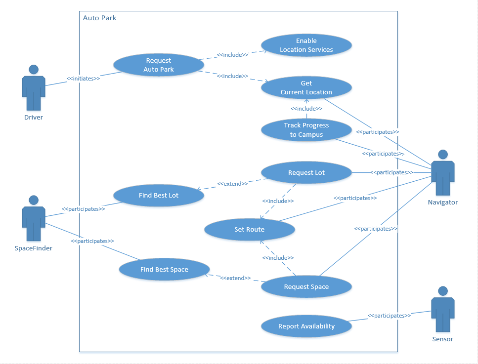
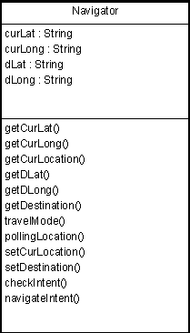
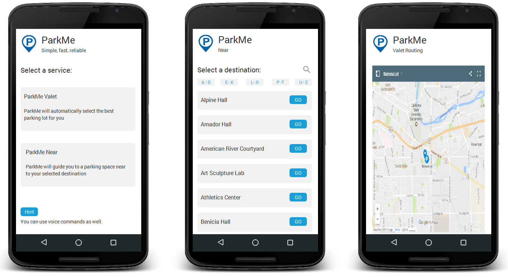

# Parking Finder Report 2
#

## Table of Contents ##

**[Group Information](#Group_information)**

**[Table of Contents](#Table_of_Contents)**

**[Introduction](#Introduction)**

**[Primary Use Cases & Interaction Diagrams](#Interaction_Diagrams)**

**[Class Diagrams](#Class_Diagrams)**

- *[Class Diagram](#class_diagram)*

- *[Data Types and Operation Signatures](#data_types)*

**[System Architecture and System Design](#System_Architecture)**

- *[Architectural Styles](#Architectural_Styles)*

- *[Identifying Subsystems](#Identifying_Subsystems)*

- *[Mapping Subsystems to Hardware](#Mapping_Subsystems)*

- *[Persistent Data Storage](#Persistent_Data_Storage)*

- *[Network Protocol](#Network_Protocol)*

- *[Global Control Flow ](#Global_Control_Flow)*
	
**[Algorithms and Data Structures](#Algorithms_and_Data_Structures)**

- *[Algorithms](#Algorithms)*

- *[Data Structures](#Data_Structures)*

**[User Interface Design and Implementation](#User_Interface_Design)**

**[Progress Report and Plan of Work](#Progress_Report)**

- *[Progress Report](#Progress_Report)*

- *[Plan of Work](#Plan_of_Work)*

- *[Breakdown of Responsibilities](#Breakdown_of_Responsibilities)*

**[References](#References)**

## Introduction ##
During the course of the semester, the Pink Unicorns team has continued to refine its ParkMe solution. Significantly, we have identified the primary product differentiation, namely, that ParkMe minimizes interactions required from both the administrative and usage perspectives. In other words, ParkMe provides an automated parking solution.

From the driver perspective, our goal is to provide a hands free option for finding a parking space, from driver initiation to parking on campus. We will leverage location tracking and routing utilizing mobile device based technologies for audio interactions and available mapping technologies. This type of solution is in sharp contrast to other solutions, such as the one made available by Sac State, which require to user to scan a map to find out where to go.

From the administrator perspective, we offer a self-reporting solution that can be placed in each parking space and can provide near real-time updates about the availability of each parking space in campus. This will enable us to both direct a driver to the best candidate parking lot at any time during the day and then route them to a vacant parking space. By comparison, the current Sac State map solution is based on the best guess of the administrator which is periodically submitted during the day.

The refinement of our solution has allowed us to focus on the key use cases which differentiate our product, and we have included the primary driver use cases below to illustrate how easy it is for drivers to use our application.

## Primary Use Cases & Interaction Diagrams ##
Minimal user interactions clearly differentiate the ParkMe app from other solutions. In fact, the app is so easy to user that a driver can simply start the solution and be routed to an available parking space, hands free. For the driver who wants to find a parking space close to a specific building on campus, the only choice required is to select the building and then ParkMe handles the rest.

The following high level use cases and interactions illustrate how simple it is to use ParkMe.

### Use Case Actors ###

**Driver** (Initiating Actor)

* A Driver can be a university student, faculty member, or campus staff. Drivers are the primary consumers of the system. A Driver's goal is to find the nearest available parking space based on their approach to campus or destination on campus.

**Sensor** (Participating Actor)

* A Sensor provides the self-report technology the system relies on to determine the occupancy status of an individual space in a parking lot. The Sensor provides real-time status updates of either occupied or vacant.

**Navigator** (Participating Actor)

* The Navigator guides a driver to a vacant parking spot. The Navigator provides several important services: first, it tracks the current location of a driver; second, it provides a route to a parking lot; third, it provide audio directions to the driver. 

**SpaceFinder** (Participating Actor)

* The SpaceFinder provides the system with real-time tabulation of the total number of vacant spaces in each parking lot on campus, and locates the best parking lot and available space.

### Use Case 1 - ParkMe Valet: Automates trip from start to finish ###

ParkMe Valet automatically routes the driver to the best parking space. The driver simply starts the app and relies on driving instructions provided by the Navigator. 

Utilizing the location service provided by a mobile device, ParkMe tracks the driver's progress toward campus, and when s/he is close to campus ParkMe checks with the SpaceFinder to find the closest parking lot with the highest availability. Once the driver enters the parking lot the Navigator requests the geo coordinates for and available space and automatically routes them to spot. 

### Use Case 2 - ParkMe Near: Lets the user park nearby a specific destination ###

ParkMe close to my destination lets the driver select a building on campus so that it can prioritize parking lots in its vicinity. 

The key difference between ParkMe Close and ParkMe Valet is that the driver can have the system prioritize parking lots close to his/her destination.

## Class Diagrams and Interaction Specifications ##

### Class Diagram ###
The diagrams below provide an overview of the key classes used in our system.

**Sensor Class Diagrams**

The sensor class utilizes a Raspberry Pi microcomputer in conjunction with a supersonic sensor which is used to detect the physical presence of a vehicle in a parking spot. When the supersonic sensor detects a vehicle, it sends a signal to the raspberry pi. From there, the pi is able to send information to the server on the status of the parking spot.

**Navigator Class Diagrams**

The Navigator class uses the users current Geo-location coordinates and the destination coordinates to setup a route. Once a route has been found the Google Maps Directions API will take over.

**SpaceFinder Class Diagrams**

ParkMe Valet mode: The SpaceFinder class tries to find the best and closest parking spot from the current location of the user.

ParkMe Near mode: The SpaceFinder class let's the user choose where they want to park from a list of locations.

The SpaceFinder class uses the database to determine whether the parking space is vacant. If the parking space chosen by the SpaceFinder class is vacant, it will create a set of Geo location coordinates, using Google Maps API, of that parking space and hand them to the Navigator class. While the driver is on route, the SpaceFinder class will keep checking as to whether the parking spot is still vacant. If the parking space happens to fill up, the SpaceFinder class will find the closest parking space from the previous parking spot, create another set of Geo-location coordinates, and give them to the Navigator Class again.

<!--- (Diagrams: Hugo) 

- driverDestination // Used in the ParkMe Near use case

Methods

- FindBestLot( pDriverDestination : destinationId = NULL )
- FindCandidateSpaceList( pLot : lotId )
- ReserveSpace( pSpace : spaceId ) --->

**REST API Class Diagrams**

The REST API relies on deep linking to build the necessary routes. The RouterAPI class dynamically builds new routes based on the current folder structure to simplify future expansion.

**Db Access Class Diagrams**

The DbAccess classes support basic CRUD operations for the parkdbcsus Cosmos DB database. In addition, some helper methods have been defined for key operations, such 

The Web and Android apps will be accessing the REST API through HTTP protocols since the database is hosted on the Azure Cloud.

**Web Admin Class Diagrams**

The WebAdmin classes are used by the system administrator to manage the parking lots with related parking spaces as well as the on campus destinations a driver can choose from in the ParkMe Near mode.

**Web DriverPark Class Diagrams**
The Web DriverPark classes are used by a driver to accomplish the following tasks: select the ParkMe mode (i.e., ParkMe Valet or ParkMe Near); optionally select a destination when the ParkMe Near mode is chosen; provide a visual map of the route.

### Data Types and Operation Signatures ###
..

## System Architecture and System Design ##

### Architectural Styles  ###

The ParkMe solution is built upon a client/server architecture and consists of three-tiers. Clients include the following: Web-based Administration and Driver sites; Android mobile app; Sensor Controllers.

**Client/Server**

1. Cloud database
2. Web Server: URL based REST API
3. Web-based Administration and Driver sites; Android-based mobile Driver app

The image below provides a high level overview of the system architecture:

### Identifying Subsystems ###

Everything will start on the sensor checking if a spot is available, then it will send the information to the database. The database comprises a subsystem that includes the components of parkings lots, spaces, and destination. The server then will communicate through the mobile app, which includes it's subsystem on services such as get lots, spaces, and destination.

The image below identifies the subsystems:

### Mapping Subsystems to Hardware ###

Outline of subsystems to hardware:

- Space Sensor: Ultrasonic Sensor HC-SR04
- Space Report: Raspberry Pi
- ParkMe Database: Azure Cosmos DB "dbName=parkdbcsus"
- REST API: Azure virtual machine
- Web Admin Site: Azure virtual machine
- Web Driver Site: Azure virtual machine
- Mobile Driver App: Android mobile device

### Persistent Data Storage ###

A repository of the parking lots will be managed in an Azure Cosmos DB. The following data schema will be used to store JSON objects.

**Parking Lot Schema**

{
"lotId" : "number",
"lotState" : "string",
"lotType" : "string",
"lotVacancy" : "number",
"lotGeoCode" : "string",
"lotDescription" : "string"
}

**Parking Space Schema**

{
"spaceId" : "number",
"spaceState" : "string",
"spaceReserved" : "boolean",
"spaceGeoCode" : "string"
}

**Destination Schema**

{
"destinationId" : "number",
"destinationTitle" : "string",
"destinationDescription" : "string"
}

### Network Protocol ###

The following network protocols are used:

- ParkMe Database REST API: HTTP 
- ParkMe Web App: HTTP
- Space Report: IoT

### Global Control Flow  ###

Our system will be based on Time-Dependency, the sensors will check the parking spot status on real-time and it will update the database every few seconds, and the results will be sent to the mobile app if it's ready to be routed.

## Algorithms and Data Structures ##

### Algorithms ###

**Design Patterns**

Observable

- Database calls via HTTP
- CandidateSpaceList collection to be notified when space availability changes

### Data Structures ###
..

## User Interface Design and Implementation ##

Simplicity is what distinguishes the ParkMe app for other solutions. Thus, the user interface is minimal since our objective is a hands-free experience for the driver once they are enroute and unless the administrator needs to upload a new park definition or suspend access to a parking space the Sensor is self-reporting so maintenance is minimal. However, we do have some simple user interfaces that can be accessed as shown below:

**Driver User Interface**

**Administration User Interface**

To Do

**Future considerations**

1. Can we initiate by voice using Google on Android (e.g., "Google, start ParkMe Valet")?
 

## Progress Report and Plan of Work ##

### Progress Report ###

The Pink Unicorns have made significant progress during the course of the semester. Starting with the basic idea to develop a solution to streamline parking on university campuses, we have iterated through the ideation process to develop an approach which leverages technology that can minimize interactions and is largely self-supporting. This is significant since our primary users will be driving while using our application and campus administrators are faced with the daunting challenge of providing real time information about the availability of parking in large lots scattered across sprawling campuses.

During our due diligence, we contacted the Sac State parking enforcement and discovered that the current approach for providing parking availability is based on a best guess algorithm where an administrator estimates the percentage of parking spaces available for each lot and periodically posts these guesses. Drivers can then access these best guesses, which may not even be timely, but they are only provided with a high level map that is poorly labelled and requires scrolling to see different sections of the campus. Imagine trying to use this interface while driving.

Two fundamental challenges were faced by our team during the design process:

1. How can we get a real-time report for the status of each parking space on campus (literally thousands of spaces)?
2. How can we help our user find the best available parking space at any giving time during the day?

Fortunately, with a bit of inspiration and the aid of technology we were able to develop a solution architecture that addressed both of these challenges. To track real-time parking availability across lots, a self-reporting sensor can be placed in each parking space and coupled with strategically located Raspberry Pi computers to report the availability of each space throughout the course of the day to a cloud-based database. This information can then be accessed through mobile devices where we tap into location services to track progress of the driver as s/he heads to campus and rely on Google Maps to narrate the route to the best parking space.  

Once we had the approach defined, we were able to begin evaluation of the necessary technology components and how to wire them together. To date, we have been able to identify how to implement the end-to-end solution using:

- Sensors - Ultrasonic sensor HC-SR04
- Sensor self-report - Raspberry Pi computers
- Cloud-based database - Azure Cosmos DB
- Cloud-based web server - Azure virtual machine
- Web app - REST API, Admin console and alternative driver app
- Android app - premium driver app

We have also started the development process, including:

- initial development of android app
- walking skeleton for Web to database of angular app

In addition, we have implemented a slack channel for team collaboration and held periodic on campus meetings for ideation and planning.

### Plan of Work ###
..

### Breakdown of Responsibilities ###

**Robert Fuller**

1. Database and REST API
2. Web Server
3. Web App
4. Web Admin

## References ##
..

