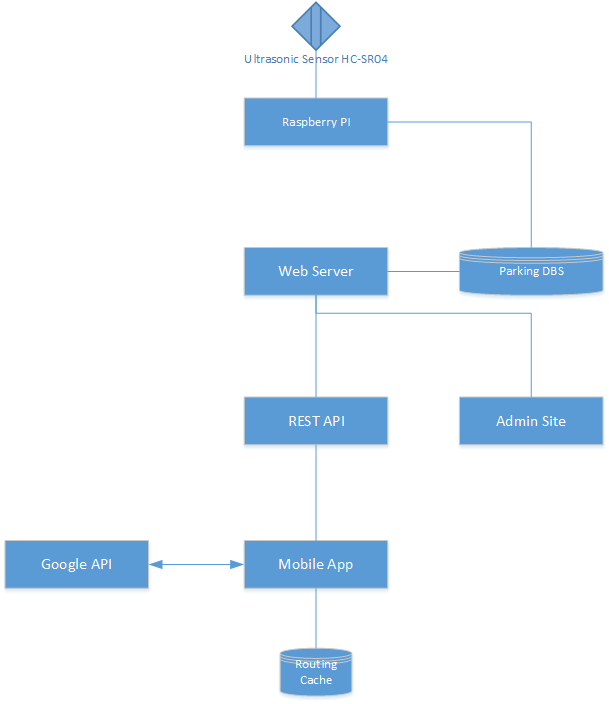

# Parking Finder Report 2
#

## Table of Contents ##

**[Group Information](#Group_information)**

**[Table of Contents](#Table_of_Contents)**

**[Introduction](#Introduction)**

**[Primary Use Cases & Interaction Diagrams](#Interaction_Diagrams)**

**[Class Diagrams](#Class_Diagrams)**

- *[Class Diagram](#class_diagram)*

- *[Data Types and Operation Signatures](#data_types)*

**[System Architecture and System Design](#System_Architecture)**

- *[Architectural Styles](#Architectural_Styles)*

- *[Identifying Subsystems](#Identifying_Subsystems)*

- *[Mapping Subsystems to Hardware](#Mapping_Subsystems)*

- *[Persistent Data Storage](#Persistent_Data_Storage)*

- *[Network Protocol](#Network_Protocol)*

- *[Global Control Flow ](#Global_Control_Flow)*
	
**[Algorithms and Data Structures](#Algorithms_and_Data_Structures)**

- *[Algorithms](#Algorithms)*

- *[Data Structures](#Data_Structures)*

**[User Interface Design and Implementation](#User_Interface_Design)**

**[Progress Report and Plan of Work](#Progress_Report)**

- *[Progress Report](#Progress_Report)*

- *[Plan of Work](#Plan_of_Work)*

- *[Breakdown of Responsibilities](#Breakdown_of_Responsibilities)*

**[References](#References)**

## Introduction ##
During the course of the semester, the Pink Unicorns team has continued to refine its ParkMe solution. Significantly, we have identified the primary product differentiation, namely, that ParkMe minimizes interactions required from both the administrative and usage perspectives. In other words, ParkMe provides an automated parking solution.

From the driver perspective, our goal is to provide a hands free option for finding a parking space, from driver initiation to parking on campus. We will leverage location tracking and routing utilizing mobile device based technologies for audio interactions and available mapping technologies. This type of solution is in sharp contrast to other solutions, such as the one made available by Sac State, which require to user to scan a map to find out where to go.

From the administrator perspective, we offer a self-reporting solution that can be placed in each parking space and can provide near real-time updates about the availability of each parking space in campus. This will enable us to both direct a driver to the best candidate parking lot at any time during the day and then route them to a vacant parking space. By comparison, the current Sac State map solution is based on the best guess of the administrator which is periodically submitted during the day.

The refinement of our solution has allowed us to focus on the key use cases which differentiate our product, and we have included the primary driver use cases below to illustrate how easy it is for drivers to use our application.

## Primary Use Cases & Interaction Diagrams ##
Minimal user interactions clearly differentiate the ParkMe app from other solutions. In fact, the app is so easy to user that a driver can simply start the solution and be routed to an available parking space, hands free. For the driver who wants to find a parking space close to a specific building on campus, the only choice required is to select the building and then ParkMe handles the rest.

The following high level use cases and interactions illustrate how simple it is to use ParkMe.

### Use Case Actors ###

**Driver** (Initiating Actor)

* A Driver can be a university student, faculty member, or campus staff. Drivers are the primary consumers of the system. A Driver's goal is to find the nearest available parking space based on their approach to campus or destination on campus.

**Sensor** (Participating Actor)

* A Sensor provides the self-report technology the system relies on to determine the occupancy status of an individual space in a parking lot. The Sensor provides real-time status updates of either occupied or vacant.

**Navigator** (Participating Actor)

* The Navigator guides a driver to a vacant parking spot. The Navigator provides several important services: first, it tracks the current location of a driver; second, it provides a route to a parking lot; third, it provide audio directions to the driver. 

**SpaceFinder** (Participating Actor)

* The SpaceFinder provides the system with real-time tabulation of the total number of vacant spaces in each parking lot on campus, and locates the best parking lot and available space.

###Use Case 1 - ParkMe Valet###

ParkMe Valet automatically routes the driver to the best parking space. The driver simply starts the app and relies on driving instructions provided by the Navigator. 

Utilizing the location service provided by a mobile device, ParkMe tracks the driver's progress toward campus, and when s/he is close to campus ParkMe checks with the SpaceFinder to find the closest parking lot with the highest availability. Once the driver enters the parking lot the Navigator requests the geo coordinates for and available space and automatically routes them to spot. 

###Use Case 2 - ParkMe Near###

ParkMe close to my destination lets the driver select a building on campus so that it can prioritize parking lots in its vicinity. 

The key difference between ParkMe Close and ParkMe Valet is that the driver can have the system prioritize parking lots close to his/her destination.

## Class Diagrams and Interaction Specifications ##

### Class Diagram ###

Please note: the outline below was just to get the discussion started during our 10/20/2017 meeting. The leads for each section are identified below. Please do not consider this to be accurate or complete, just delete the text and post your diagrams as you get them done.

**LocationService Class**

GetMobileLocation()

**Navigator Class**

(Diagrams: Cecilia)

The Navigator class uses the users current Geo-location coordinates and the destination coordinates to setup a route. Once a route has been found the Google Maps Directions API will take over.

**SpaceFinder Class**

(Diagrams: Hugo)

- driverDestination

Methods
- FindBestLot()
- FindCandidateSpaceList()

**Design Patterns**

Observable
- Database Calls via Http
- CandidateSpaceLislst to be notified when space availability state changes

**REST API**

(Diagrams: Robert)

The REST API relies on deep linking to build the necessary routes. The RouterAPI class dynamically builds new routes based on the current folder structure to simplify future expansion.

**DbAccess**

(Diagrams: Robert)

**Admin Class**

(Diagrams: Robert)

Methods
- ListLots()
- ListSpacesInLot()
- UploadLot()
- SuspendLot()
- SuspendSpace()

### Data Types and Operation Signatures ###
..

## System Architecture and System Design ##

### Architectural Styles  ###

**Client/Server**
1. Centralized database
2. URL based REST API

### Identifying Subsystems ###

(Diagrams: Adrian)

Added the following image as a reference point to build Subsystems diagram.

### Mapping Subsystems to Hardware ###

(Diagrams: Adrian)

### Persistent Data Storage ###
..

### Network Protocol ###

- Http used for access to database through REST API

### Global Control Flow  ###

Our system will be based on Time-Dependency, the sensors will check the parking spot status on real-time and it will update the database every few seconds, and the results will be sent to the mobile app if it's ready to be routed.

## Algorithms and Data Structures ##

### Algorithms ###
..

### Data Structures ###
..

## User Interface Design and Implementation ##

Simplicity is what distinguishes the ParkMe app for other solutions. Thus, the user interface is minimal since our objective is a hands-free experience for the driver once they are enroute and unless the administrator needs to upload a new park definition or suspend access to a parking space the Sensor is self-reporting so maintenance is minimal.

However, we do have some simple user interfaces that can be accessed as shown below:

TO DO:

1. Driver selects mode: ParkMe Valet or ParkMeNear
2. Driver enables location service
3. Admin can do the following: i) define lot, ii) Upload lot, iii) Suspend lot/space, etc.

Outstanding considerations:

1. How does Raspberry PI communicate with CosmosDB (e.g., IoT protocol)?
2. How do we handoff to Google Maps app (e.g., can we start the GoogleMaps app from our Android app and pass it either GeoCodes or a Route and then call Start Route so that we have a hands free scenario for audio)?

Future considerations:

1. Can we initiate by voice using Google on Android (e.g., "Google, start ParkMe Valet")?
 

## Progress Report and Plan of Work ##

### Progress Report ###

The Pink Unicorns have made significant progress during the course of the semester. Starting with the basic idea to develop a solution to streamline parking on university campuses, we have iterated through the ideation process to develop an approach which leverages technology that can minimize interactions and is largely self-supporting. This is significant since our primary users will be driving while using our application and campus administrators are faced with the daunting challenge of providing real time information about the availability of parking in large lots scattered across sprawling campuses.

During our due diligence, we contacted the Sac State parking enforcement and discovered that the current approach for providing parking availability is based on a best guess algorithm where an administrator estimates the percentage of parking spaces available for each lot and periodically posts these guesses. Drivers can then access these best guesses, which may not even be timely, but they are only provided with a high level map that is poorly labelled and requires scrolling to see different sections of the campus. Imagine trying to use this interface while driving.

Two fundamental challenges were faced by our team during the design process:

1. How can we get a real-time report for the status of each parking space on campus (literally thousands of spaces)?
2. How can we help our user find the best available parking space at any giving time during the day?

Fortunately, with a bit of inspiration and the aid of technology we were able to develop a solution architecture that addressed both of these challenges. To track real-time parking availability across lots, a self-reporting sensor can be placed in each parking space and coupled with strategically located Raspberry Pi computers to report the availability of each space throughout the course of the day to a cloud-based database. This information can then be accessed through mobile devices where we tap into location services to track progress of the driver as s/he heads to campus and rely on Google Maps to narrate the route to the best parking space.  

Once we had the approach defined, we were able to begin evaluation of the necessary technology components and how to wire them together. To date, we have been able to identify how to implement the end-to-end solution using:

- Sensors - Ultrasonic sensor HC-SR04
- Sensor self-report - Raspberry Pi computers
- Cloud-based database - Azure Cosmos DB
- Cloud-based web server - Azure virtual machine
- Web app - REST API, Admin console and alternative driver app
- Android app - premium driver app

We have also started the development process, including:

- initial development of android app
- walking skeleton for Web to database of angular app

In addition, we have implemented a slack channel for team collaboration and held periodic on campus meetings for ideation and planning.

### Plan of Work ###
..

### Breakdown of Responsibilities ###

**Robert Fuller**

1. Database and REST API
2. Web Server
3. Web App
4. Web Admin

## References ##
..

